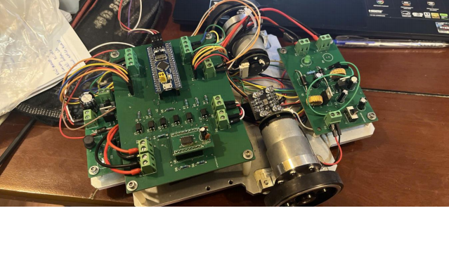
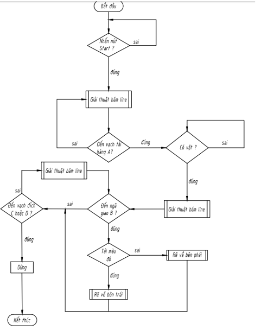

# 🤖 STM32 Autonomous Line Following Robot

An autonomous mobile robot developed using **STM32 microcontroller**, capable of **line tracking**, **automatic sensor calibration**, and **color-based navigation** using a TCS3200 color sensor.

---

## 📷 Robot Overview

<p align="center">
  
</p>

---

## 🧠 System Features

✅ PID Line Following Control
✅ 5-Channel Analog Line Sensor TCRT5000
✅ Automatic Sensor Calibration
✅ Color Detection (TCS3200)
✅ State Machine Navigation
✅ Branch Decision Based on Package Color
✅ STM32 HAL Driver Implementation

---

## ⚙️ Hardware Components

| Component    | Description           |
| ------------ | --------------------- |
| MCU          | STM32F103C8T6         |
| Motor Driver | Tb6612FNG             |
| Sensors      | TCRT5000              |
| Color Sensor | TCS3200               |
| Motors       | JGB37-520 12v 333rpm  |
| Power        | Li-ion Battery Pack   |

---

## 🧩 System Architecture

<p align="center">
  
</p>

---

## 🔄 Robot State Machine

```
START
  ↓
Go To Station
  ↓
Read Package Color
  ↓
Escape Station
  ↓
Follow Line + Branch Decision
  ↓
Finish
```

---

## 🎯 Control Algorithm

### Line Position Error

Weighted sensor method:

* Left → Negative Error
* Center → Zero Error
* Right → Positive Error

### PID Controller

```
PID = Kp * Error + Ki * Integral + Kd * Derivative
```

Used to dynamically adjust left/right motor speeds.

---

## 🎨 Color Detection Logic

TCS3200 sensor measures frequency response:

* RED filter measurement
* BLUE filter measurement
* Multiple sampling for reliability
* Majority voting color decision

Robot behavior:

* 🔴 Red Package → Turn Left
* 🔵 Blue Package → Turn Right

---

## 🧪 Automatic Calibration

At startup the robot:

1. Spins in place
2. Records sensor MIN/MAX values
3. Normalizes readings for robust tracking

---

## 📁 Project Structure

```
├── Core/
│   └── Src/
│       └── main.c
├── Drivers/
├── images/
│   ├── robot.jpg
│   ├── demo.gif
│   └── system_diagram.png
└── README.md
```

---

## 🛠️ Software Stack

* STM32CubeIDE
* STM32 HAL Library
* Embedded C
* DMA + Timer + ADC
* PWM Motor Control

---

## ▶️ Getting Started

1. Clone repository
2. Open project in STM32CubeIDE
3. Build project
4. Flash firmware to STM32 board
5. Power robot and run 🚀

---

## 📈 Future Improvements

* Velocity PID control using encoder feedback
* Dynamic speed adjustment
* Obstacle detection
* ROS integration

---

## ⭐ If you like this project

Give it a ⭐ on GitHub!
